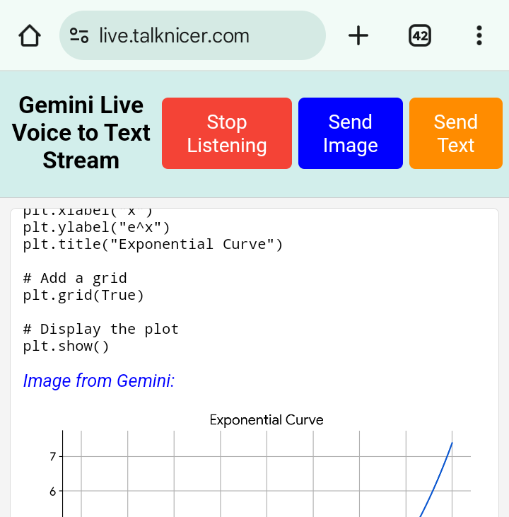

# Gemini Live Voice to Text Realtime Stream

This **Gemini Live Voice to Text Realtime Stream** running at [live.talknicer.com](https://live.talknicer.com) is a web application that provides a free, live, real-time voice-to-text large language model interaction experience using Google's new `js-genai` API. This project harnesses the power of Gemini 2.0 Flash Live in real-time to provide a seamless voice-driven experience for users, allowing them to chat with the model while reading the output instead of having to wait much longer for synthesized speech, which can't be skimmed. Google Search and Python code execution (with image output) are available, along with image upload (including from the camera on mobile), text input (including pasting), and both markdown and LaTeX output display. It runs entirely in the browser after the API key cookie is set, and was built in Firebase Studio with about 90% vibe coding and deployed on Google Cloud Run.

## Key features:
*   **Real-time Voice Input:** Sends speech directly to the model as you speak, providing immediate and blazingly fast responses.
*   **Interactive Conversation:** Allows users to engage in a continuous conversation with the model. Output is rendered correctly from both markdown and LaTeX. Text input, including from copy/paste, is available when needed.
*   **Google Search Integration**: The `gemini-2.0-flash-live-001` model performs Google searches on request for up to date information.
*   **Code Execution:** The model is able to execute python code to do complex computations for you, and show you both text and image output such as `matplotlib` graphs.
*   **Image upload:** Including from the camera on mobile devices.
*   **Context preservation:** The discussion output, along with uploaded images and code execution source and results, is preserved across Stop/Start Listening.
*   **Single-Page Application:** The entire client-side logic resides within a single HTML file (`gemini-live.html`), simplifying deployment and enhancing user experience.
*   **Client-Side JavaScript:** The core functionality, including voice capture, transcription, and interaction with the js-genai API, is implemented in JavaScript, making the application highly responsive.
*   **Secure API Key Management:** Utilizes Flask to securely manage the API key by setting it as a cookie. The user is asked to provide their own key, preventing the need to hardcode an API key or run in to rate limits.
*   **Invalid API Key Detection:** If an incorrect API key is provided, the app invalidates the cookie and asks for the key again.

## Technology stack:
*   **JavaScript:** For client-side logic, voice recording, and LLM API interaction.
*   **Flask:** A lightweight web framework for setting the API key cookie and serving the HTML, entirely in `main.py`.
*   **HTML/CSS/JS:** The single `gemini-live.html` file contains the entire client application.

## Execution:
To run the server: `python -m flask --app main run` and then visit the endpoint from a browser where the API key cookie can be set.

## Requirements:
The server only needs `Flask` installed (`pip install flask`), but the client JavaScript uses Google's `js-genai`, and the `marked`, `katex`, and `marked-katex-extension` libraries, none of which need to be installed.

If you just serve the `gemini-live.html` file from `localhost` with a hardcoded API key, you don't need Flask.

## Documentation:
* https://ai.google.dev/gemini-api/docs/live
* https://googleapis.github.io/js-genai/main/index.html
* https://github.com/googleapis/js-genai

## License:
This code is released under the free MIT License.

By Jim Salsman, April 11-15, 2025.
